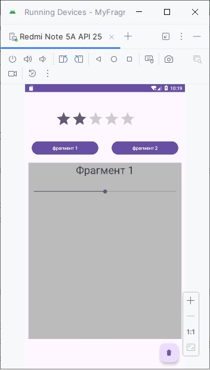
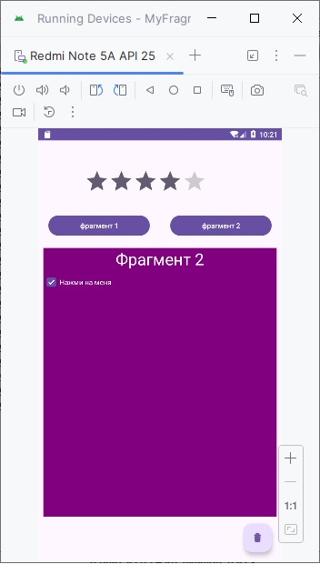

# 
MyFragmentApp  
 

### Описание
Демонстрация работы с фрагментами.
MainActivity разделён на 2 части. В нижней части подключаются фрагменты. Переключение фрагментов происходит нажатием соответствующей кнопки "Фрагмент 1" или "Фрагмент 2"

-

